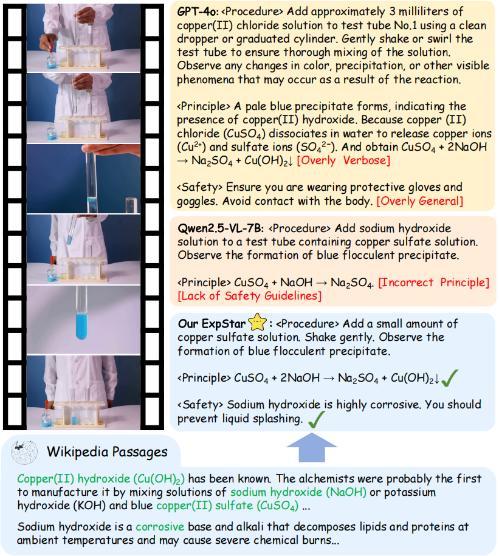
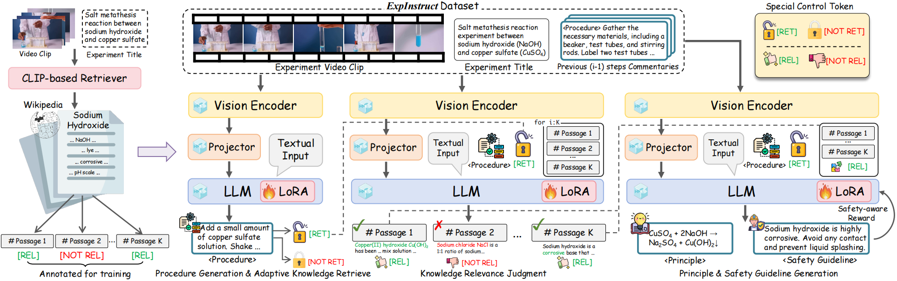

<div align="center">

# ExpStar: 面向多学科科学实验的自动解说生成

<p align="center">
  <a href="README.md">English</a> |
  <a href="README_CN.md">中文</a>
</p>

[](https://arxiv.org/abs/2507.09693)
[](https://arxiv.org/abs/2507.09693)
[](https://cgl-pro.github.io/expstar/)
[](https://github.com/Gary-code/ExpStar)

</div>

## 摘要
实验解说在描述实验程序、深入探讨基础科学原理以及整合相关安全指南方面起着至关重要的作用。在实践中，教师需要依靠学科专业知识并投入大量时间来准备这样的解说。为了应对这一挑战，我们提出了跨学科科学实验自动解说生成这一任务。尽管近期大型多模态模型(LMMs)在视频理解和推理方面展现出了令人瞩目的能力，但它们在生成细粒度和富有洞察力的实验解说方面的能力仍然有待探索。在本文中，我们做出以下贡献：

1. **数据集构建**：我们构建了**ExpInstruct**，这是首个专门面向实验解说生成的数据集，包含来自3个核心学科21个科学学科的超过7000个步骤级解说。每个样本都包含程序描述以及相关的科学原理和安全指南。

2. **模型创新**：我们提出ExpStar，一个利用检索增强机制来自适应地访问、评估和利用外部知识的自动实验解说生成模型。

3. **实验结果**：大量实验表明，我们的ExpStar优于16个有竞争力的LMMs，突显了我们的数据集和模型的优越性。

我们相信ExpStar在推进AI辅助科学实验教学方面具有巨大潜力。



## ExpStar模型


## 数据

ExpInstruct数据集包括：
- 7000+步骤级解说
- 21个科学学科
- 3个核心学科
- 程序描述
- 科学原理
- 安全指南


## ExpStar流程说明

该部分对ExpStar的整体流程进行说明，涵盖了数据处理、模型训练、推理与评估的完整流程。以下为各模块功能及使用说明。

### 目录结构

```
repo/
├── code/                # 主要代码目录
│   ├── 1video_commentary_pair_construction/  # 视频-讲解对构建
│   ├── 2dataset_construction/                # 数据集构建
│   ├── 3retrevial/                           # 检索相关代码（支持多种检索器）
│   ├── 4train/                               # 训练脚本
│   ├── 5infer/                               # 推理脚本
│   └── 6eval/                                # 评估脚本
├── Demo/                # 数据与结果示例
│   ├── 1data/           # 原始数据（视频、ASR、步骤等）
│   ├── 2pair-data/      # 视频-讲解对
│   ├── 3baseline_dataset/    # baseline数据集
│   ├── 4Expstar_dataset/     # ExpStar数据集
│   ├── 5Expstar_rl_dataset/  # ExpStar_RL数据集
│   ├── 6Expstar_result/      # 推理结果示例
│   └── 7eval/                # 评估数据示例
└── README_CN.md            # 项目说明文档
```

### 数据处理流程

1. **原始数据清洗**  
   - 位于 `Demo/1data/`，包括原始视频、ASR转写、实验步骤（部分通过GPT-4o自动补充安全与原理信息）。
2. **视频-讲解对构建**  
   - 使用 `code/1video_commentary_pair_construction/` 处理，生成示例详见 `Demo/2pair-data/`。
3. **数据集构建**  
   - 通过 `code/2dataset_construction/`，生成 baseline、ExpStar、ExpStar_RL 数据集，生成示例详见 `Demo/3baseline_dataset/`、`Demo/4Expstar_dataset/`、`Demo/5Expstar_rl_dataset/`。
4. **检索增强（RAG）**  
   - 参考 `code/3retrevial/`，支持多种检索器（如 CLIP、EVA_CLIP、ViCLIP）和检索方式。

### 模型训练

- 推荐使用 4 卡 A100 进行训练。
- 包含 SFT（监督微调）与 DPO（偏好优化）两阶段训练。
- 训练脚本：
  - SFT: `code/4train/expstar_train.sh`
  - DPO: `code/4train/rl_dpo.sh`

### 推理流程

- baseline 推理采用单轮对话，脚本：`code/5infer/baseline_data_infer.sh`
- ExpStar 推理采用多轮对话，客户端-服务器模式：
  - 服务器端：`code/5infer/deploy_multi_port.sh`
  - 客户端：`code/5infer/expstar_data_infer.py`
- 推理结果示例见 `Demo/6Expstar_result/`

### 评估

- 批量评估脚本：`code/6eval/batch_evaluate.py`
- 评估所用数据格式示例见 `Demo/7eval/`

### 其他说明

- 各阶段数据、结果均有 Demo 示例，便于复现和理解流程。
- 检索增强部分代码参考了 [self-rag](https://github.com/AkariAsai/self-rag)项目。

## 引用

如果您觉得我们的工作有帮助，请考虑引用：

```bibtex
@article{expstar,
  title={ExpStar: Towards Automatic Commentary Generation for Multi-discipline Scientific Experiments},
  author={Jiali Chen, Yujie Jia, Zihan Wu, Jinyu Yang, Jianpeng Chen, Xusen Hei, Jiayuan Xie, Yi Cai, Li Qing},
  journal={https://arxiv.org/abs/2507.09693},
  year={2025}
}
```

## 许可证

本项目采用 [MIT 许可证](LICENSE)。
